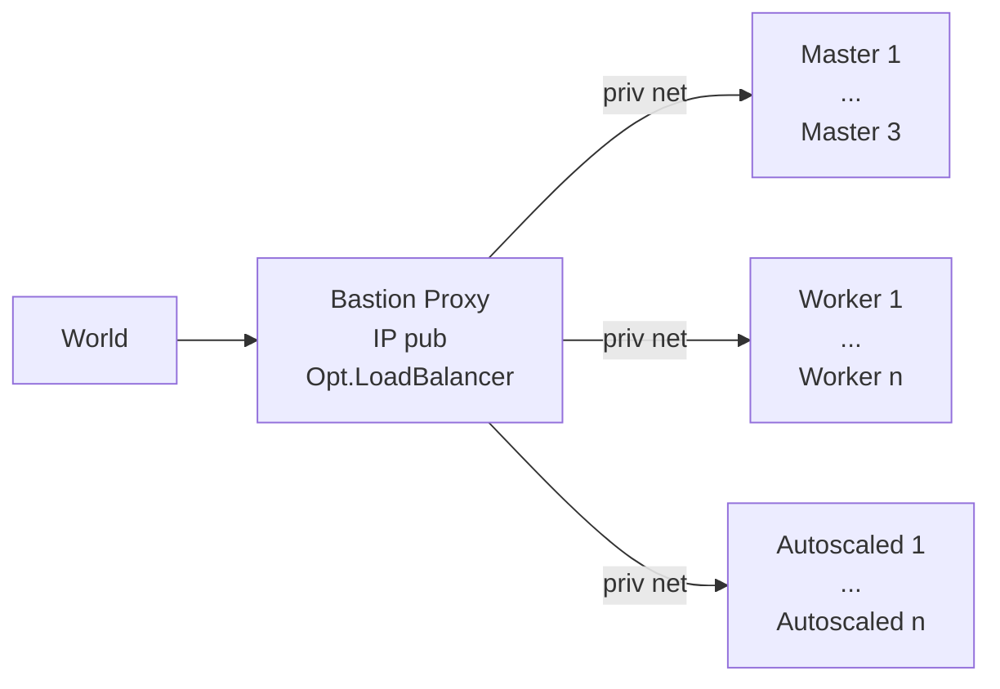

# Hetzner K3s - Pythonic

> A set of functions to setup K3s clusters on [HCloud][hcloud], based on vitobotta's [hetzner-k3s][hk3s]

## About

[Hetzner-k3s][hk3s] is nicely engineered general k3s installation tool on Hetzner, with a large degree of declarative possibilities for customization. As terraform, it is a single static binary and idempotent, with a single source of truth. In contrast to terraform it is straightforward to use, with far less abstractions but a lot of built in best practices, incl CNI and autoscaling, plus faster.

This repo here provides a set of **python functions**, incl. possibly useful support tools to organize them, in order to further automate _around_ the pure k3s installation, which hetzner-k3s provides.

## Usage

- See [justfile](./justfile) for the available functions.
- See [tests](./.github/workflows/test.yml) for setup

## Proxied K3s Installation

This is created, from your laptop:

That bastion server is the only one with a public IP, and is equipped with a l4 loadbalancer, forwarding the traffic into the cluster, like a hetzner loadbalancer would do.

[hk3s]: https://github.com/vitobotta/hetzner-k3s
[hcloud]: https://docs.hetzner.cloud/
