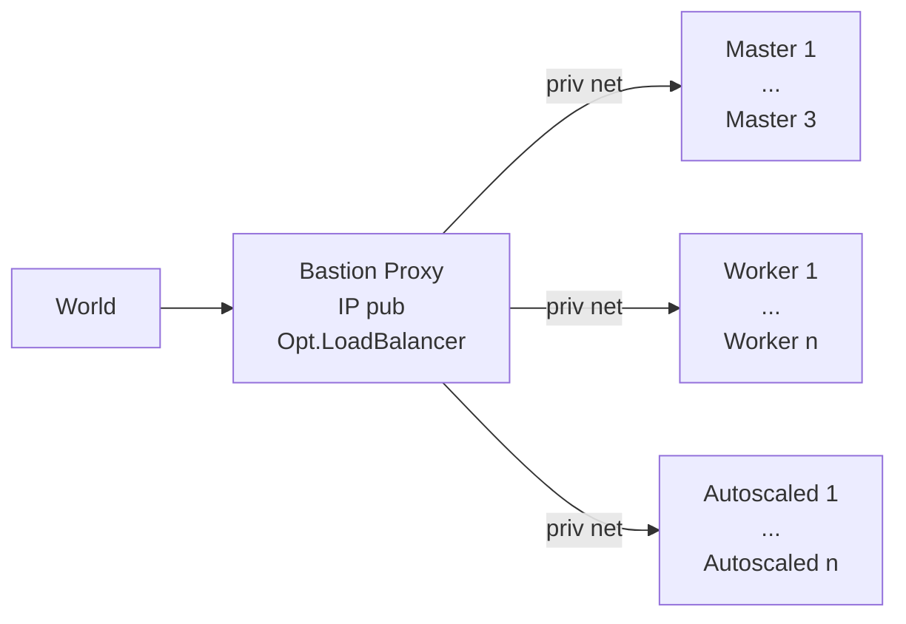

[](https://github.com/axgkl/pyhk3/actions/workflows/test.yml)
# Hetzner K3s - Pythonic


> A set of functions to setup K3s clusters on [HCloud][hcloud], based on vitobotta's [hetzner-k3s][hk3s]

## About

[Hetzner-k3s][hk3s] is nicely engineered general k3s installation tool on Hetzner, with a large degree of declarative possibilities for customization. As terraform, it is a single static binary and idempotent, with a single source of truth. In contrast to terraform it is straightforward to use, with far less abstractions but a lot of built in best practices, incl CNI and autoscaling, plus faster.

This repo here provides a set of **python functions**, incl. possibly useful support tools to organize them, in order to further automate _around_ the pure k3s installation, which hetzner-k3s provides.


## Usage

- See [justfile](./justfile) for the available functions.
- See [tests](./.github/workflows/test.yml) for setup

## Flow From Scratch

1. just create-cluster
2. just port-forward # kubectl now works
1. just flux-install
1. just tekton-install # cloud native build system
1. just p tekton port_forward # dashboard


## Proxied K3s Installation

This is created, from your laptop:



That bastion server is the only one with a public IP, and is equipped with a l4 loadbalancer, forwarding the traffic into the cluster, like a hetzner loadbalancer would do.

## flux basics
Entry point is clusters/production - there all yaml files are evaluated, pointing to infra and apps.

### Q: Why does `dependsOn` work in `clusters/production/infrastructure.yaml` but not in `infrastructure/tekton/config/kustomization.yaml`?

#### A: The key differences between these two files and why `dependsOn` works in one but not the other:

1. `clusters/production/infrastructure.yaml`:
   - This is a Flux Kustomization resource
   - It's a Kubernetes custom resource (CR) that Flux uses to manage deployments
   - It has its own API schema that includes `dependsOn` as a valid field
   - Example structure:
   ```yaml
   apiVersion: kustomize.toolkit.fluxcd.io/v1
   kind: Kustomization
   metadata:
     name: infra-tekton
   spec:
     dependsOn:
       - name: some-other-kustomization
   ```

2. `infrastructure/tekton/config/kustomization.yaml`:
   - This is a Kustomize configuration file
   - It's used by the `kustomize` tool to build Kubernetes manifests
   - It has a different API schema that doesn't include `dependsOn`
   - Example structure:
   ```yaml
   apiVersion: kustomize.config.k8s.io/v1beta1
   kind: Kustomization
   resources:
     - tektonconfig.yaml
   ```

### The key differences are:

1. **Purpose**:
   - Flux Kustomization: Manages the deployment lifecycle, including ordering and dependencies
   - Kustomize config: Just builds and transforms Kubernetes manifests

2. **API Version**:
   - Flux Kustomization: `kustomize.toolkit.fluxcd.io/v1`
   - Kustomize config: `kustomize.config.k8s.io/v1beta1`

3. **Functionality**:
   - Flux Kustomization: Can handle dependencies, health checks, and deployment ordering
   - Kustomize config: Only handles manifest building and transformation

That's why the `dependsOn` in `infrastructure.yaml` works - it's telling Flux to wait for the operator to be ready before applying the config. The Kustomize config file can't do this because it's just a build tool, not a deployment manager.

Think of it this way:
- Kustomize is like a build tool that creates the Kubernetes manifests
- Flux is like a deployment manager that decides when and how to apply those manifests

The dependency needs to be managed at the deployment level (Flux) rather than the build level (Kustomize).

[hk3s]: https://github.com/vitobotta/hetzner-k3s
[hcloud]: https://docs.hetzner.cloud/
