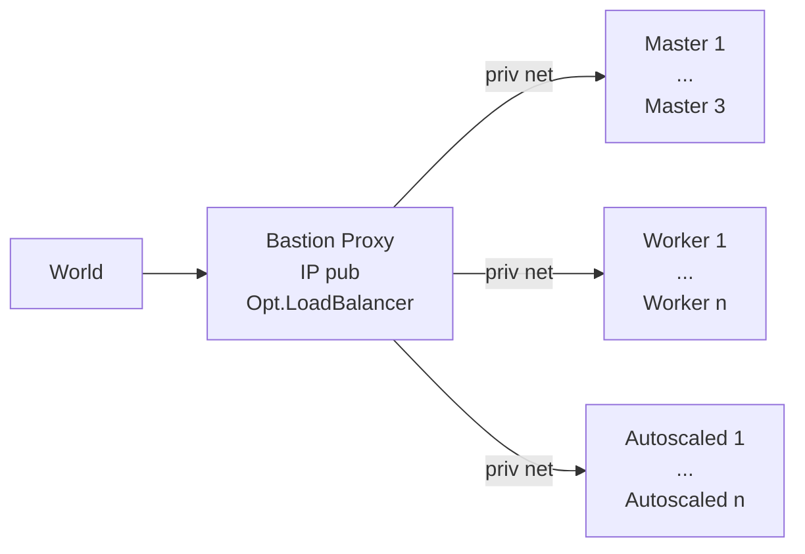

[](https://github.com/axgkl/pyhk3/actions/workflows/test.yml)
# Hetzner K3s - Pythonic


> A collection of functions to setup K3s clusters on [Hetzner Cloud][hcloud], based on vitobotta's [hetzner-k3s][hk3s]

## About

[Hetzner-k3s][hk3s] is nicely engineered general k3s installation tool on Hetzner, with a large degree of declarative possibilities for customization. As terraform, it is a single static binary and idempotent, with a single source of truth. In contrast to terraform it is straightforward to use, with far less abstractions but a lot of built in best practices, incl CNI and autoscaling, plus faster.

This repo here provides a set of **python functions**, incl. possibly useful support tools to organize them, in order to further automate _around_ the pure k3s installation, which hetzner-k3s provides.


## Features

### Pre K3s Installation

Focus is on creating the cluster with private IPs only, and a _proxy_ server in front of them:



That bastion server is the only one with a public IP, and is equipped with a l4 loadbalancer, forwarding the traffic into the cluster, like a hetzner loadbalancer would do.

💡 Using the bastion node as loadbalancer is optional. [hetzner-k3s][hk3s] does by default create hetzner loadbalancers for you, using the hetzner cloud controller manager (ccm).

[Here](./docs/l4lb.md) is a detailed description of the loadbalancer setup, incl. some reasons for it.

---

We provide the functions necessary to

- create the private network
- bastion node itself, incl. ssh key and make it know to hetzner.
- tools (hetzner-k3s, kubectl, helm) and [load balancer service](./docs/l4lb.md) on it
- cloud init config for hetzner-k3s, so that the priv ip nodes can reach the internet

Then hetzner-k3s can be run from there, to create the cluster.

### K3s Installation

From the proxy server, we then kick off hetzner-k3s, using a config we synthesized from the environ.

[Here](./docs/privip.md) are the details regarding a private IP only cluster setup.

### Post K3s Installation

We provide functions to

- transfer kubeconfig from the bastion to the local machine
- configure local ssh
- install cert-manager into the cluster
- install ingress-nginx into the cluster
- install services using that ingress into the cluster, in a way so that https traffic from the world can reach the application pods with
  - working certificates
  - optional pod affinity via cookie ("sticky sessions")
  - source ip preservation (using [proxy protocol](https://www.haproxy.org/download/1.8/doc/proxy-protocol.txt))
  - autoscaling support

## Usage

In general the script provides its functions after being sourced from a bash script _you_ provide and make executable.

See the ci [../tests/setup.sh](../tests/setup.sh) script for an example, which installs the full cluster from scratch.


💡 When you pass _arguments_ to that script, this results in an execution of the given function and exit of the script, w/o running the subsequent functions after sourcing.


General layout of your script is therefore:

```bash
CONFIGVAR1=CONFIGVAL1
...
source <dir>/main.sh "$@" # exits after execution of any given arguments in $@ (e.g. funcname, params). 
#Otherwise continues with the functions below:
setup_function1
setup_function2
...
```

`yourscript -h` lists all available functions.

## CI Automation

See [here](./docs/ci.md)


## Customization

See [here](./docs/customization.md)

## Dev Details

[here](./docs/customization.md)

---

#### Local kubectl/helm support

You want to copy the kubeconfig file, which the installer script created on the bastion node to your local machine, so that you can manage the cluster from there.

I change the server line within the copied local kubeconfig to this:

```yaml
server: https://127.0.0.1:16443
```

and configure ssh like this:

```config
# ---- cluster citest
Host citest-proxy
    HostName 37.27.... # pub ip of the bastion node
    User root
    Port 22
    LocalForward 16443 10.1.0.3:6443 # first master
Host citest-m1
    HostName 10.1.0.3
    User root
    Port 22
    ProxyCommand ssh -W %h:%p citest-proxy
Host citest-m2
    HostName 10.1.0.4
    User root
    Port 22
    ProxyCommand ssh -W %h:%p citest-proxy
Host citest-m3
    HostName 10.1.0.5
    User root
    Port 22
    ProxyCommand ssh -W %h:%p citest-proxy
# ---- cluster citest
```

#### Load Balancer on Bastion Node

You can install a layer 4 load balancer on bastion, turning it into a full proxy into your cluster, eradicating the need for a hetzner load balancer.

[This repo](https://github.com/axgkl/hk3sf) explains how to do that.

## Refs

- [notes](./docs/knowledge.md)

- <https://community.hetzner.com/tutorials/how-to-set-up-nat-for-cloud-networks>
- <https://github.com/vitobotta/hetzner-k3s>
- <https://github.com/vitobotta/hetzner-k3s/issues/379>
- <https://www.youtube.com/watch?v=u5l-F8nPumE&t=466s>
- <https://gimlet.io>

---

K3s with: HA + AutoScaling + GitOps from scratch. 💗 For < 20€/month if wanted.

[hk3s]: https://github.com/vitobotta/hetzner-k3s
[hcloud]: https://docs.hetzner.cloud/
 
 
 
 
 
 
 
