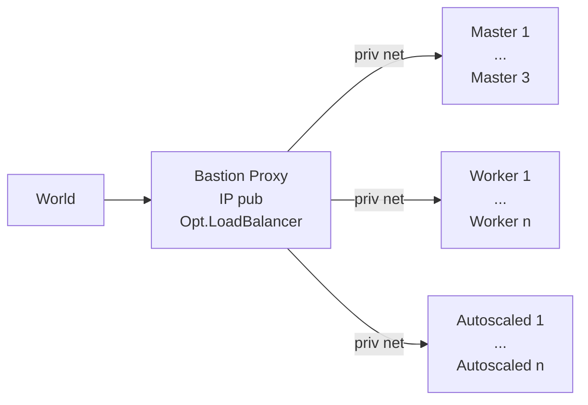

# Private IP Only Cluster

Below details about a private IP only cluster, set up with [hetzner-k3s][hk], are provided.

We describe a setup, where the cluster is 'behind' a proxy node, with a pub ip, reachable via ssh. Alternatively, you could add a vpn on top.


Why:

1. want a cost effective cluster, but
1. don't want to ever have to recover a broken k8s. So: 3 masters.
1. => Workloads on (cheap) masters - but with **autoscaled** add/delete workers if required.

IPs: Priv IPs are for free -> Only 1 pub IP (on a bastion outside the k8s cluster, which runs trivially restorable services w/o k8s). Also more secure, only this to shield.

💡 [This repo](https://github.com/axgkl/pyhk3) provides a set of python functions, to automate that setup.

💡 The node may be super slim, resource/cost wise. Distribution: We tested with ubuntu/amd64, but any other _should_ work as well.

## Features

- Creates a private network, using the hetzner ui, say on 10.1.0.0/16, named `ten-1`.
- Creates a bastion node, with a pub ip and membership within that network. Usually that first node gets `.2` assigned, i.e. `10.1.0.2` in our example.
- Secures the node but keeps allowing outgoing traffic to the internet and ssh access from your local machine, possibly from a jump host.
- Kicks off the installation of the cluster, using [hetzner-k3s][hk], with a config, which creates a private IP only cluster.
- Installs tools


### Tools Installed

- [hetzner-k3s][hk]
- [kubectl](https://kubernetes.io/docs/tasks/tools/install-kubectl/)
- [helm](https://helm.sh/docs/intro/install/)

💡 The setup function in this repo use [binenv][binenv] to install kubectl and helm, since fast, distri independent and w/o the need for a big package mgmt. framework.


#### Notes on the Post Create Config

We add this post create commands hetzner-k3s:

```yaml
post_create_commands:
  - echo "Started" > /.status # just to debug
  - timedatectl set-timezone Europe/Berlin
  - echo 'ecdsa-sha2-nistp256 AAAAE2V....= root@citest-proxy' >> /root/.ssh/authorized_keys
  - echo 'ecdsa-sha2-nistp256 AAAAE2V....= gk@axgk' >> /root/.ssh/authorized_keys
  - echo "root:$(head -c 50 /dev/urandom | base64)" | chpasswd
  - mkdir -p /etc/network/interfaces.d
  - iface="$(ip -o -4 addr list | grep " 10.1." | cut -d " " -f 2)"
  - |
    cat > /etc/network/interfaces.d/$iface <<EOF
    auto $iface
    iface $iface inet dhcp
      post-up ip route add default via 10.1.0.1
      post-up ip route add 169.254.169.254 via 172.31.1.1
    EOF
  - rm -f /etc/resolv.conf
  - |
    cat > /etc/resolv.conf <<EOF
    nameserver 185.12.64.1
    nameserver 185.12.64.2
    edns edns0 trust-ad
    search .
    EOF
  - ip route add 169.254.0.0/16 via 172.31.1.1
  - ip route add default via 10.1.0.1
  - echo "Done" > /.status # just to debug
```


These commands are basically run as cloud init, after a node is created.

Since we use the 'classic' way of configuring the network, using /etc/network/interfaces.d, on ubuntu we needed to add the `ifupdown` package.

- Added ssh pub keys, which should be allowed to log in to the k3s nodes.
- Run `chpasswd`, in order to avoid any mails from hetzner, reminding you to change the password, after autoscaled nodes are created.
- Find the interface name of the one interface, which is in the private network (distri dependent)
- Create the interface config file, with the default route to the gateway of the private network, which is our bastion node. This has to be the `.1` address, not the priv ip of the bastion node!
- Also add a route to hetzner's api server on 169.254.169.254, which seems to be always via 172.31.1.1
- Lastly we configure hetzner's DNS servers and configure the above routes via cli commands, avoiding the need for a reboot.

With such a config, the hetzner-k3s setup should run through, creating a private IP only cluster.

[hk]: https://github.com/vitobotta/hetzner-k3s
[binenv]: https://github.com/devops-works/binenv


