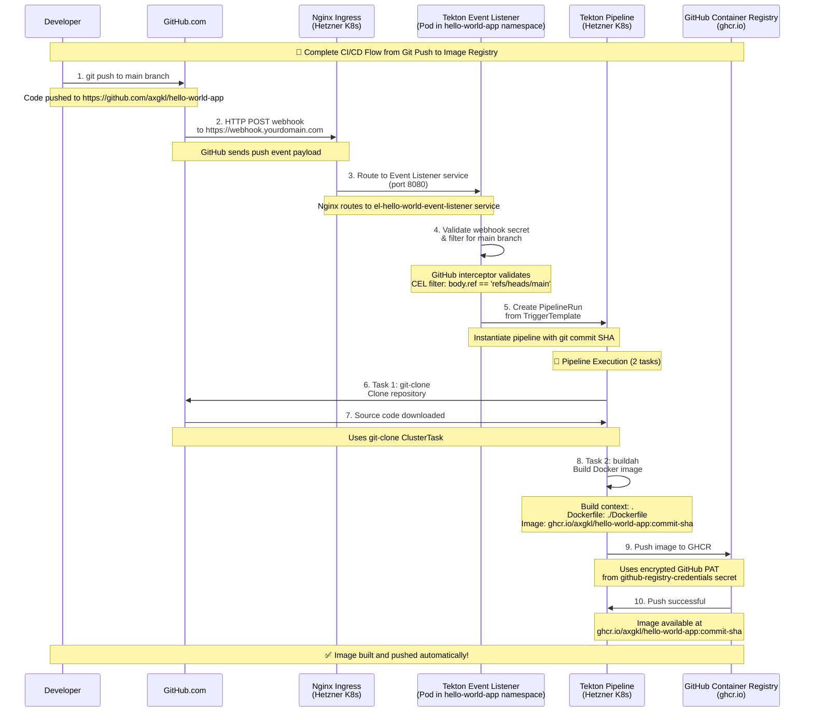

# Tekton Builds

```mermaid
sequenceDiagram
    participant Dev as Developer
    participant GitHub as GitHub.com
    participant Ingress as Nginx Ingress<br/>(Hetzner K8s)
    participant EventListener as Tekton Event Listener<br/>(Pod in hello-world-app namespace)
    participant Tekton as Tekton Pipeline<br/>(Hetzner K8s)
    participant Registry as GitHub Container Registry<br/>(ghcr.io)

    Note over Dev, Registry: 🚀 Complete CI/CD Flow from Git Push to Image Registry

    Dev->>GitHub: 1. git push to main branch
    Note over Dev, GitHub: Code pushed to https://github.com/axgkl/hello-world-app

    GitHub->>Ingress: 2. HTTP POST webhook<br/>to https://webhook.yourdomain.com
    Note over GitHub, Ingress: GitHub sends push event payload

    Ingress->>EventListener: 3. Route to Event Listener service<br/>(port 8080)
    Note over Ingress, EventListener: Nginx routes to el-hello-world-event-listener service

    EventListener->>EventListener: 4. Validate webhook secret<br/>& filter for main branch
    Note over EventListener: GitHub interceptor validates<br/>CEL filter: body.ref == 'refs/heads/main'

    EventListener->>Tekton: 5. Create PipelineRun<br/>from TriggerTemplate
    Note over EventListener, Tekton: Instantiate pipeline with git commit SHA

    Note over Tekton: 🔄 Pipeline Execution (2 tasks)

    Tekton->>GitHub: 6. Task 1: git-clone<br/>Clone repository
    GitHub->>Tekton: 7. Source code downloaded
    Note over Tekton, GitHub: Uses git-clone ClusterTask

    Tekton->>Tekton: 8. Task 2: buildah<br/>Build Docker image
    Note over Tekton: Build context: .<br/>Dockerfile: ./Dockerfile<br/>Image: ghcr.io/axgkl/hello-world-app:commit-sha

    Tekton->>Registry: 9. Push image to GHCR
    Note over Tekton, Registry: Uses encrypted GitHub PAT<br/>from github-registry-credentials secret

    Registry->>Tekton: 10. Push successful
    Note over Registry, Tekton: Image available at<br/>ghcr.io/axgkl/hello-world-app:commit-sha

    Note over Dev, Registry: ✅ Image built and pushed automatically!
```
